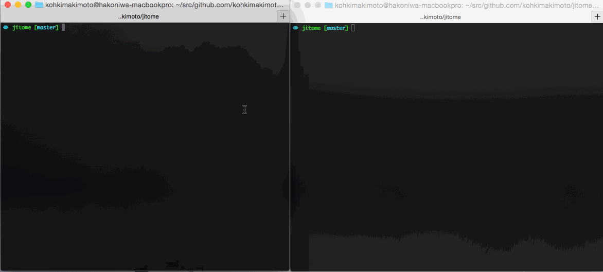

# Jitome


Jitome is a watcher for file changing



## Installation

```
$ go get github.com/kohkimakimoto/jijtome
```

## Usage

Create `.jitome` configuration file. The following is an example. The file format is [TOML](https://github.com/toml-lang/toml).

```toml
[build]
watch=["*.go"]
command="go build"

[test]
watch=["*.go"]
command="your test command"
```

Run `jitome`

```
$ jitome
```

To use `FILE` environment variable, you can get a file path that is detected changing

```toml
[display_modified_file]
watch="*"
command="cat $FILE"
```

## Author

Kohki Makimoto <kohki.makimoto@gmail.com>

## License

The MIT License (MIT)

## Inspired by

* [cespare/reflex](https://github.com/cespare/reflex)
* [romanoff/gow](https://github.com/romanoff/gow)
* [nathany/looper](https://github.com/nathany/looper)
