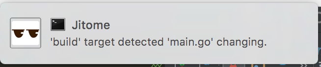

# Jitome

[](https://travis-ci.org/kohkimakimoto/jitome)


Jitome is a simple file watcher.

Table of Contents

* [Requirement](#requirement)
* [Installation](#installation)
* [Usage](#usage)
* [Configuration](#configuration)
  * [Targets](#targets)
    * [Notification](#notification)
    * [Restart](#restart)
  * [Command](#command)
* [Author](#author)
* [License](#license)
* [Inspired by](#inspired-by)

## Requirement

Go1.6 or later.

## Installation

```
$ go get github.com/kohkimakimoto/jitome
```

## Usage

Run `jitome -i` to create `jitome.yml` file that is a main configuration file for Jitome.

```yaml
# Jitome is a simple file watcher. - https://github.com/kohkimakimoto/jitome

# command.
# command: "your/server/start/command"

# targets.
targets:
  build:
    notification: true
    restart: false
    watch:
      - base: ""
        ignore: [".git"]
        pattern: "*.go"
    script: |
      go build .
```

Run `jitome`.

```
$ jitome
[jitome] starting jitome...
[jitome] loading config 'jitome.yml'
[jitome] evaluating target 'build'.
[jitome] watching files...
```

Jitome starts watching file changing. So if you modify files, Jitome report as the following.

```
[jitome] 'build' target detected 'main.go' changing by event 'create'.
[jitome] 'build' target running script...
[jitome] 'build' target finished script.
```

## Configuration

Default configuration file that Jitome uses is `jitome.yml` at the current directory. you can change it by using `-c` option.

The following is an example of the configuration.

```yaml
command: "your/server/start/command"
targets:
  build:
    watch:
      - base: ""
        ignore: [".git"]
        pattern: "*.go"
    script: |
      go build .

  test:
    watch:
      - base: ""
        ignore: [".git"]
        pattern: "*.go"
    script: |
      go test .
```

### Targets

The ***targets*** are configurations for file watching.

Each target as the above example `build` and `test` defines watching patterns and a script that runs when it detects file changing.

#### Notification

Targets support desktop notification (Mac OS X only). Set `notification` property `true`.

```yaml
targets:
  build:
    notification: true
    watch:
      - base: ""
        ignore: [".git"]
        pattern: "*.go"
    script: |
      go build .
```



#### Restart


### Command


## Author

Kohki Makimoto <kohki.makimoto@gmail.com>

## License

The MIT License (MIT)

## Inspired by

* [cespare/reflex](https://github.com/cespare/reflex)
* [romanoff/gow](https://github.com/romanoff/gow)
* [nathany/looper](https://github.com/nathany/looper)
* [mattn/goemon](https://github.com/mattn/goemon)
